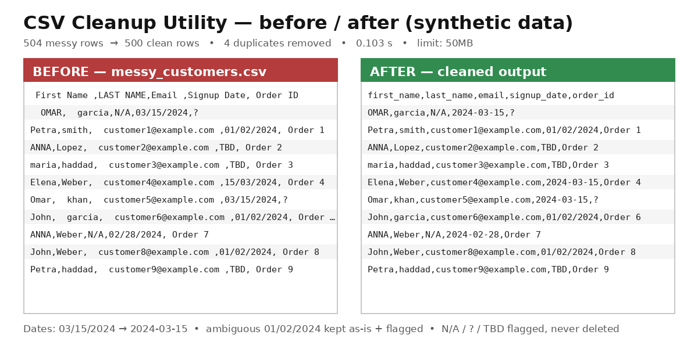

# CSV Cleanup Utility — proof of work (synthetic demo data)

A local Python utility that cleans messy CSV files: trims whitespace, standardizes
column names, normalizes dates to `YYYY-MM-DD`, deduplicates rows with a full change
log, and flags placeholder values (`N/A`, `?`, `TBD`) instead of deleting them.
Everything runs on your machine — no uploads. Handles files up to **50MB**.

**Clean, normalize and deduplicate CSV files locally. $12 one-time purchase:
https://6586260690482.gumroad.com/l/vrykvv**

## What it did to this demo file

All data here is **100% synthetic** (fake customers, generated for demonstration).

| | Before | After |
|---|---|---|
| Rows | 504 | 500 (4 exact duplicates removed, each logged) |
| Column names | ` First Name `, `LAST NAME`, `Email ` … | `first_name`, `last_name`, `email` … |
| Whitespace | `"  OMAR"`, `"customer3@example.com "` | `"OMAR"`, `"customer3@example.com"` |
| Dates | `03/15/2024`, `15/03/2024` | `2024-03-15` (ISO) |
| Ambiguous dates | `01/02/2024` | kept exactly as-is, flagged for review |
| Placeholders | `N/A`, `?`, `TBD` | kept, flagged — never silently deleted |
| Processing time | — | **0.103 seconds** for 504 rows |

## Files in this repo

- `messy-customers.csv` — the deliberately messy input (synthetic)
- `messy-customers.cleaned.csv` — the cleaned output
- `messy-customers.changelog.txt` — every change logged, line by line
- `messy-customers.flags.csv` — row, column, original value, and reason for each flagged value
- `before-after.png` — visual before/after

The paid utility itself (`csv_cleaner.py`) is not published here — it is delivered
on purchase. This repo is only the proof.

**$12 one-time, yours forever: https://6586260690482.gumroad.com/l/vrykvv**
